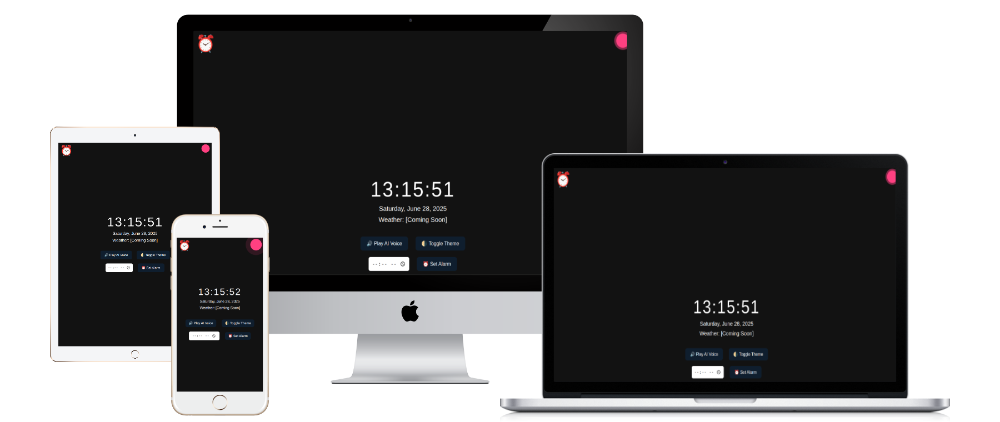

# ⏰ Advanced AI Clock – By Harshad Teli

A modern, interactive AI-powered digital clock with voice greeting, theme switcher, alarm, and animated interface. Built using only HTML, CSS, and JavaScript.

---

## 🌟 Features

- 🕒 Real-time digital clock (HH:MM:SS)
- 📅 Dynamic date display
- 🔊 AI voice greeting (preloaded audio)
- 🌗 Light/Dark theme toggle
- 🎙️ Voice pulse animation while AI speaks
- 🖼️ AI assistant GIF shown during audio
- ⏰ Alarm input with voice/audio notification
- 👋 Auto greeting on page load
- ☁️ Weather placeholder (for future upgrade)
- 📱 Fully responsive for mobile, tablet, and desktop
- 🧠 Branded as **FICMX by Developer**

---

## 🚀 Getting Started

🛠️ Built With

HTML5

CSS3

Vanilla JavaScript

---

📷 Screenshots

---

## 🖥️ Live Demo

---

## 🔗 Connect with Me

---
👨‍💻 Developer

This Project Developed  by Developer
Crafted with 💖 by Harshad Teli.

---

📜 License

This Project do not required any license.

---
© 2025 Harshad Teli | All rights reserved

---

